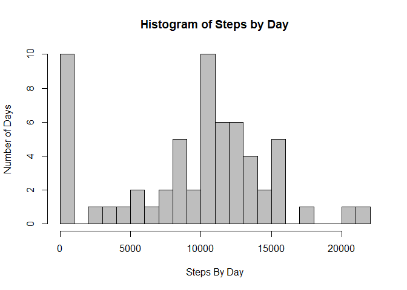
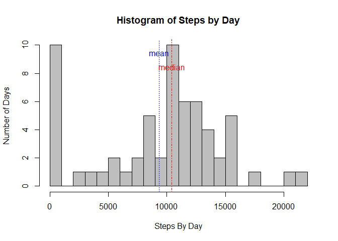
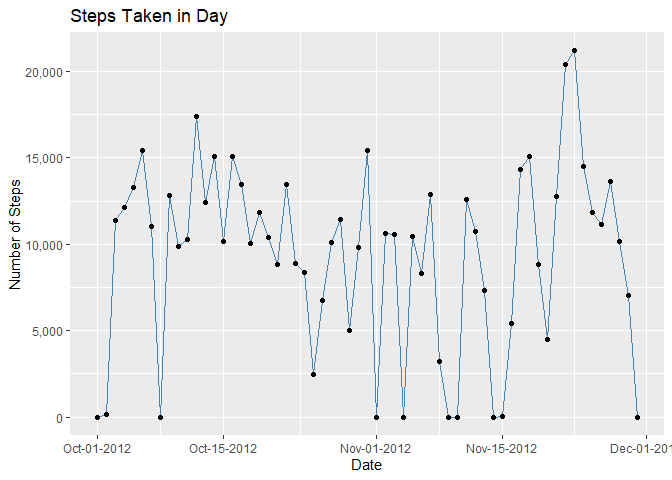
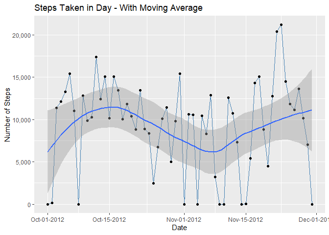
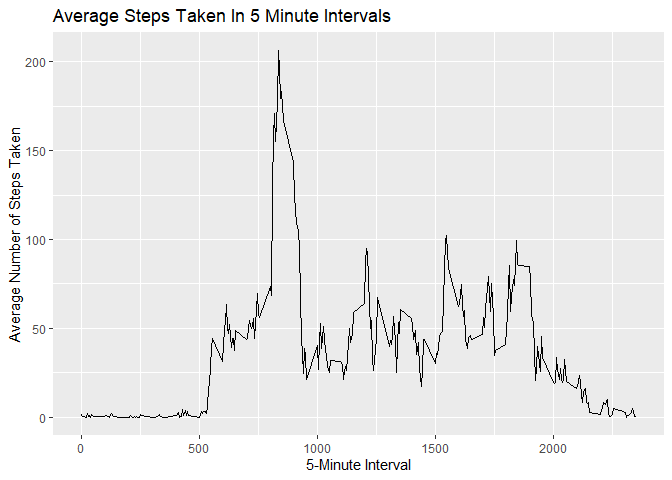
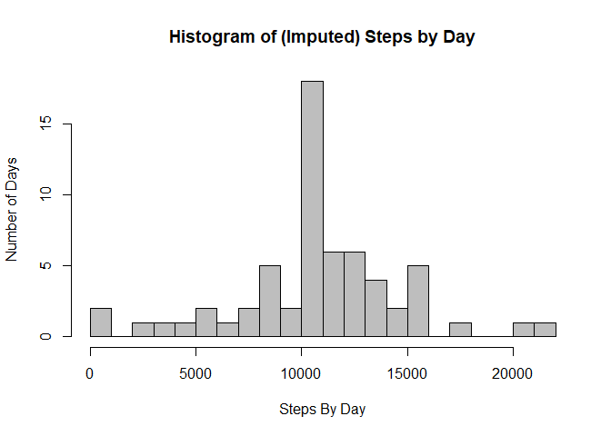
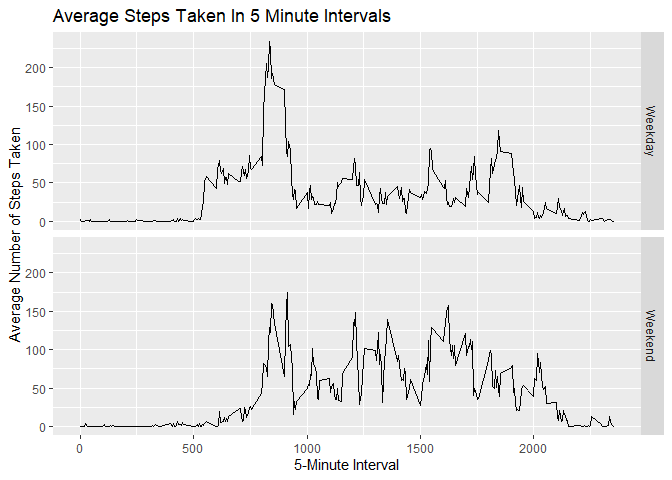

### Load libraries

```r
library(dplyr)
library(ggplot2)
library(scales)   
```


### Loading and preprocessing the data
Download, unzip, and read in csv


```r
if (!file.exists(paste0(getwd(), '/data/activity.csv')) )
{
  fileUrl <- "https://d396qusza40orc.cloudfront.net/repdata%2Fdata%2Factivity.zip"
  download.file(fileUrl, destfile = paste0(getwd(), '/repdata%2Fdata%2Factivity.zip'), method = "curl")
  unzip("repdata%2Fdata%2Factivity.zip",exdir = "data")
}
df <- read.csv(paste0(getwd(), '/data/activity.csv'), stringsAsFactors = FALSE)
df$date <- as.Date(df$date)

str(df)
```

```
## 'data.frame':	17568 obs. of  3 variables:
##  $ steps   : int  NA NA NA NA NA NA NA NA NA NA ...
##  $ date    : Date, format: "2012-10-01" "2012-10-01" ...
##  $ interval: int  0 5 10 15 20 25 30 35 40 45 ...
```


#### 1. Make Histogram of the total number of steps taken each day


```r
stepsByDay <- df %>% group_by(date) %>% summarize(steps = sum(steps, na.rm=TRUE))
head(stepsByDay)
```

```
## # A tibble: 6 x 2
##   date       steps
##   <date>     <int>
## 1 2012-10-01     0
## 2 2012-10-02   126
## 3 2012-10-03 11352
## 4 2012-10-04 12116
## 5 2012-10-05 13294
## 6 2012-10-06 15420
```

```r
hist(stepsByDay$steps, main="Histogram of Steps by Day", xlab= "Steps By Day", ylab="Number of Days", breaks=20, col="gray")
```

<!-- -->

Note that we ignored NA values with na.rm=TRUE


####  2. Calculate the mean and median number of steps taken each day

The mean number of steps per day is

```r
mean(stepsByDay$steps)
```

```
## [1] 9354.23
```
and the median number of steps per day is

```r
median(stepsByDay$steps)
```

```
## [1] 10395
```

Next, we can add these values to the histogram 


```r
stepsByDay <- df %>% group_by(date) %>% summarize(steps = sum(steps, na.rm=TRUE))
hist(stepsByDay$steps, 
     main="Histogram of Steps by Day", 
     xlab= "Steps By Day", 
     ylab="Number of Days", 
     breaks=20, 
     col="gray")
abline(v=mean(stepsByDay$steps), lty=3, col="blue")
text(mean(stepsByDay$steps),10,labels="mean", pos=1, col="blue") 
abline(v=median(stepsByDay$steps), lty=4, col="red")
text(median(stepsByDay$steps),9,labels="median", pos=1, col="red") 
```

<!-- -->


####  3. Make a Time Series Plot of the Average Number of Steps Taken


```r
ggplot(stepsByDay, aes(x=date, y=steps)) +   
  geom_line( color="steelblue") + 
  geom_point() + 
  xlab("Date") + 
  ylab("Number of Steps") + 
  scale_x_date(date_labels = "%b-%d-%Y") + 
  scale_y_continuous(labels=comma) + 
  ggtitle("Steps Taken in Day")
```

<!-- -->

And then if we want to see the moving average line and band, we can add geom_smooth(method="loess") 


```r
ggplot(stepsByDay, aes(x=date, y=steps)) +   
  geom_line( color="steelblue") + 
  geom_point() + 
  geom_smooth(method="loess") +  #adds moving average 
  xlab("Date") + 
  ylab("Number of Steps") + 
  scale_x_date(date_labels = "%b-%d-%Y") + 
  scale_y_continuous(labels=comma) + 
  ggtitle("Steps Taken in Day - With Moving Average")
```

<!-- -->


####  4. Find 5-minute interval that, on average, contains the maximum number of steps

First, summarize data by interval


```r
stepsByInterval <- df %>% group_by(interval) %>% summarize(steps = mean(steps, na.rm=TRUE))
head(stepsByInterval)
```

```
## # A tibble: 6 x 2
##   interval  steps
##      <int>  <dbl>
## 1        0 1.72  
## 2        5 0.340 
## 3       10 0.132 
## 4       15 0.151 
## 5       20 0.0755
## 6       25 2.09
```

Then can find the maximum


```r
maxinterval <- stepsByInterval[which.max(stepsByInterval$steps), ]$interval
maxinterval 
```

```
## [1] 835
```

Or can visualize it in plot


```r
ggplot(data=stepsByInterval, aes(x=interval, y=steps)) +
  geom_line() +
  xlab("5-Minute Interval") +
  ylab("Average Number of Steps Taken") + 
  scale_y_continuous(labels=comma) + 
  ggtitle("Average Steps Taken In 5 Minute Intervals")
```

<!-- -->


### Imputing Missing Values


#### Calculate and report the total number of missing values in the dataset

The total number of rows with at least 1 NA is

```r
sum(!complete.cases(df))
```

```
## [1] 2304
```

The total number of NAs is

```r
sum(is.na(df))
```

```
## [1] 2304
```


#### Devise a strategy for filling in all of the missing values in the dataset

We will make a new variable 'steps2' that will fill in the missing values of 'steps' with the overall average for the interval

step 1: Summarize the data by interval


```r
 stepsByInterval <- df %>% group_by(interval) %>% summarize(avgsteps = mean(steps, na.rm=TRUE)) %>% ungroup()
 head(stepsByInterval)
```

```
## # A tibble: 6 x 2
##   interval avgsteps
##      <int>    <dbl>
## 1        0   1.72  
## 2        5   0.340 
## 3       10   0.132 
## 4       15   0.151 
## 5       20   0.0755
## 6       25   2.09
```

step 2: Merge it back to original dataframe


```r
df <- merge(df, stepsByInterval, by="interval", all.x = TRUE)
head(df)
```

```
##   interval steps       date avgsteps
## 1        0    NA 2012-10-01 1.716981
## 2        0     0 2012-11-23 1.716981
## 3        0     0 2012-10-28 1.716981
## 4        0     0 2012-11-06 1.716981
## 5        0     0 2012-11-24 1.716981
## 6        0     0 2012-11-15 1.716981
```

step 3: Calculate 'steps2'


```r
 df <- df %>% mutate(steps2 = ifelse(is.na(steps), avgsteps, steps))  
head(df)
```

```
##   interval steps       date avgsteps   steps2
## 1        0    NA 2012-10-01 1.716981 1.716981
## 2        0     0 2012-11-23 1.716981 0.000000
## 3        0     0 2012-10-28 1.716981 0.000000
## 4        0     0 2012-11-06 1.716981 0.000000
## 5        0     0 2012-11-24 1.716981 0.000000
## 6        0     0 2012-11-15 1.716981 0.000000
```

step 4: Create a new dataset that is equal to the original dataset but with the missing data filled in.

```r
df2 <- df %>% select(interval, date, steps2) %>% rename(steps = steps2)
head(df2)
```

```
##   interval       date    steps
## 1        0 2012-10-01 1.716981
## 2        0 2012-11-23 0.000000
## 3        0 2012-10-28 0.000000
## 4        0 2012-11-06 0.000000
## 5        0 2012-11-24 0.000000
## 6        0 2012-11-15 0.000000
```


#### Make Histogram of the total number of steps taken each day after missing values are imputed


```r
 steps2ByDay <- df %>% group_by(date) %>% summarize(steps2 = sum(steps2, na.rm=TRUE))
 hist(steps2ByDay$steps2,  breaks=20, col="gray", main="Histogram of (Imputed) Steps by Day", xlab= "Steps By Day", ylab="Number of Days")
```

<!-- -->


#### Calculate the mean and median number of steps taken each day

The mean number of steps per day is

```r
mean(steps2ByDay$steps2)
```

```
## [1] 10766.19
```
and the median number of steps per day is

```r
median(steps2ByDay$steps2)
```

```
## [1] 10766.19
```

Note that after imputing the NAs, the mean changed by

```r
mean(steps2ByDay$steps2) - mean(stepsByDay$steps) 
```

```
## [1] 1411.959
```
and the median changed by

```r
median(steps2ByDay$steps2) - median(stepsByDay$steps) 
```

```
## [1] 371.1887
```


### Weekdays vs Weekends


#### Create a new factor variable in the dataset with two levels – “weekday” and “weekend” indicating whether a given date is a weekday or weekend day.


```r
df <- df %>% mutate(day_type = ifelse(weekdays(df$date) %in% c("Saturday", "Sunday"), "Weekend", "Weekday"))
head(df)
```

```
##   interval steps       date avgsteps   steps2 day_type
## 1        0    NA 2012-10-01 1.716981 1.716981  Weekday
## 2        0     0 2012-11-23 1.716981 0.000000  Weekday
## 3        0     0 2012-10-28 1.716981 0.000000  Weekend
## 4        0     0 2012-11-06 1.716981 0.000000  Weekday
## 5        0     0 2012-11-24 1.716981 0.000000  Weekend
## 6        0     0 2012-11-15 1.716981 0.000000  Weekday
```

#### Make a panel plot containing a time series plot of the 5-minute interval (x-axis) and the average number of steps taken, averaged across all weekday days or weekend days (y-axis)


```r
stepsByInterval <- df %>% group_by(day_type, interval) %>% summarize(steps = mean(steps, na.rm=TRUE)) %>% ungroup()
ggplot(data=stepsByInterval, aes(x=interval, y=steps), color=day_type) +
  geom_line() +
  xlab("5-Minute Interval") +
  ylab("Average Number of Steps Taken") + 
  scale_y_continuous(labels=comma) + 
  ggtitle("Average Steps Taken In 5 Minute Intervals") + facet_grid(day_type ~ .)
```

<!-- -->


